## **💬 프로젝트 소개**

---

<aside>
💡 대회를 간편하게 개최/참여하고 블록체인으로 수상과 참가 내역을 투명하게 관리하는 서비스
</aside>

 

## ✍🏻 기획 배경

---

> 대회 홍보를 효과적으로 하기 위한 방법/간편하게 대회를 검색하고 참여하는 방법을 모른다.
대회 안내를 위한 페이지 제작이 어렵고, 수상과 참여 증명이 어렵다.
> 
- 대회를 간편하게 등록하고 참가자를 관리할 수 있는 프로젝트
- 여러 곳에 흩어져있는 대회 정보를 하나의 플랫폼에서 확인할 수 있도록 돕는 프로젝트
- 블록체인 네트워크를 이용하여 수상,참가 내역을 안전하고 무결하게 관리하는 프로젝트

 

## **🙋 팀원 소개**

---

|  |  |  |  |  |  |
| --- | --- | --- | --- | --- | --- |
| [안준현](https://github.com/alloy31) | [강다솔](https://github.com/DasollKang) | [강태연](https://github.com/snowman2810) | [김재윤](https://github.com/jaeyun1723) | [남혜미](https://github.com/namhyemi) | [이성목](https://github.com/CocoIsCat) |
| 팀장,  Block Chain | Backend | Backend, Infra | Frontend, Infra | Frontend | Block Chain |

 

## **🛠️ 기술 스택**

---

**프론트엔드**

**백엔드**

  

**블록체인**

**인프라**

**협업**

 

## **🏃‍♂️ 유저 플로우**
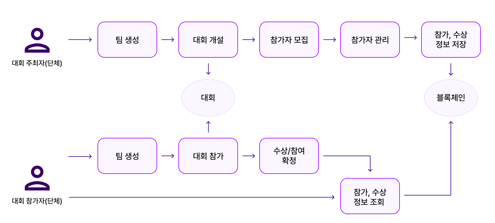

 

## **📚 산출물**
[API 명세서](./산출물/API%20명세서) &nbsp; &nbsp;
[ERD](./산출물/ERD.png)

 

## **🛠️ 아키텍처 다이어그램**
서비스 서버
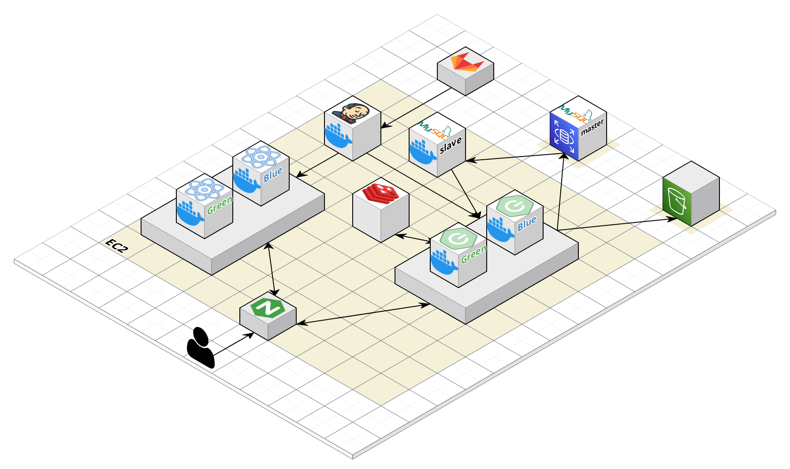
블록체인 서버
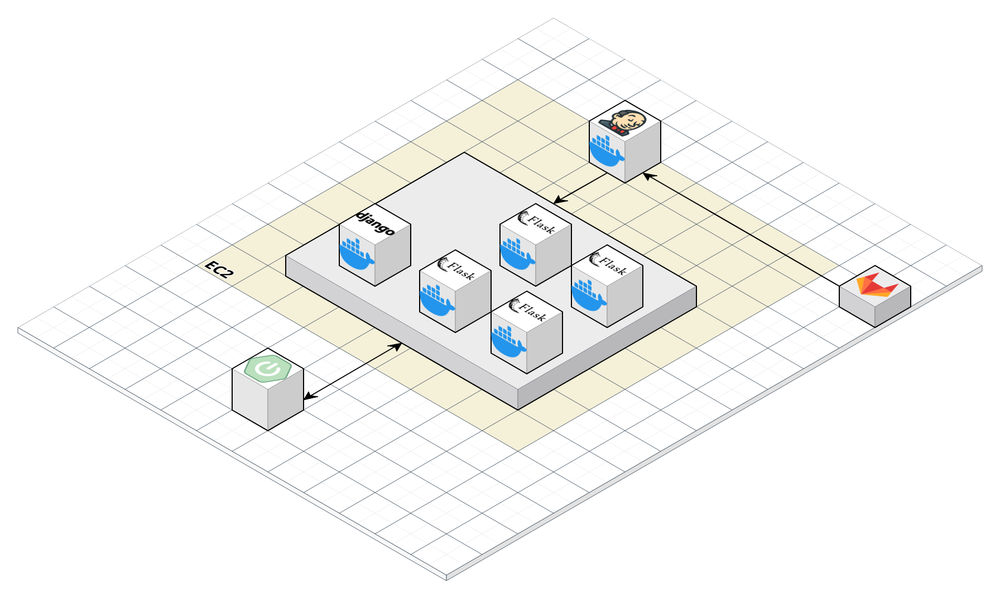

 

## **🎬 실행 방법**

[포팅 메뉴얼](./exec) 참고

 

## **🎮 주요 기능**

### 메인 화면

### 수상 확인
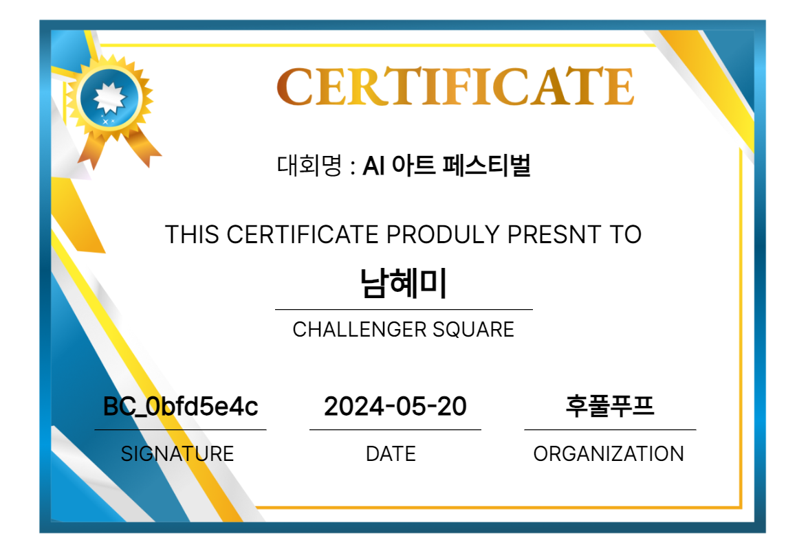
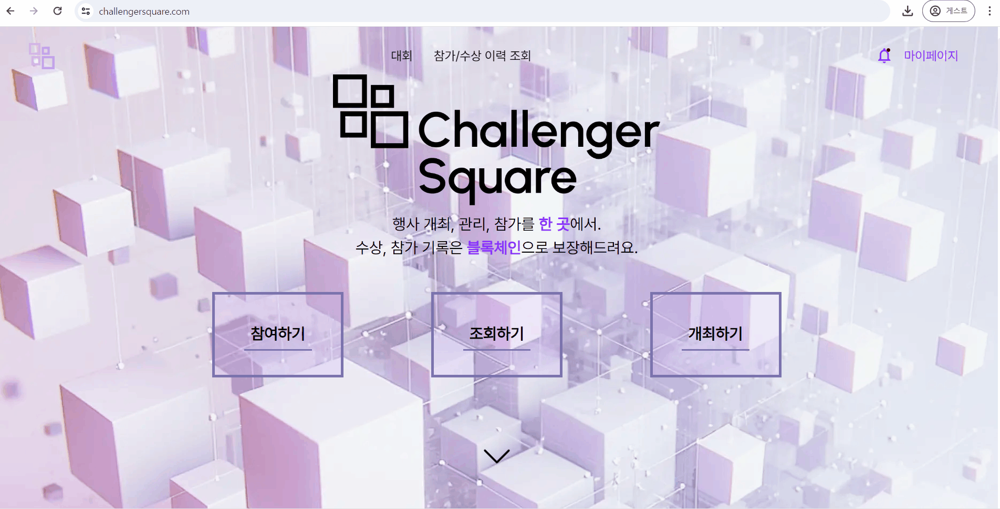

### 팀
팀 가입 신청
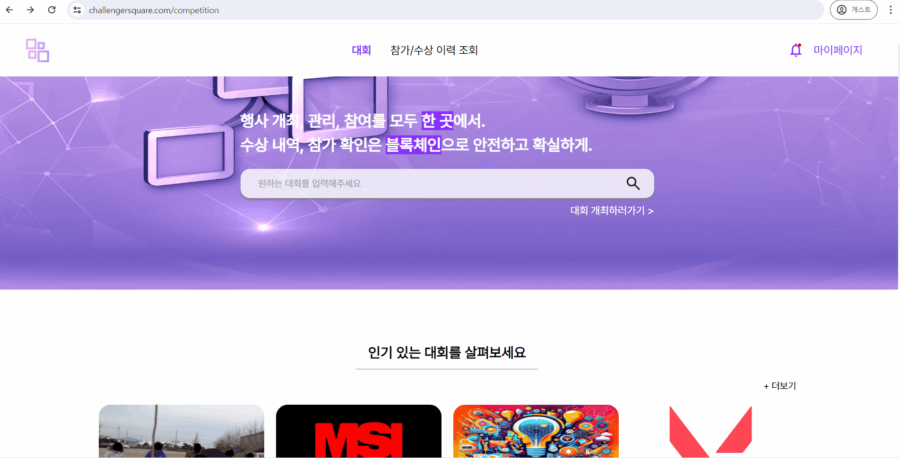
팀 가입 수락 / 거절
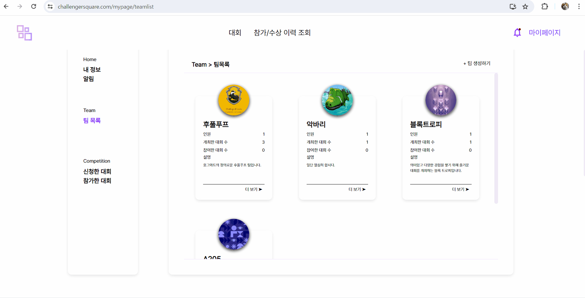

### 대회
대회 메인 페이지

대회 검색

대회 상세

대회 등록
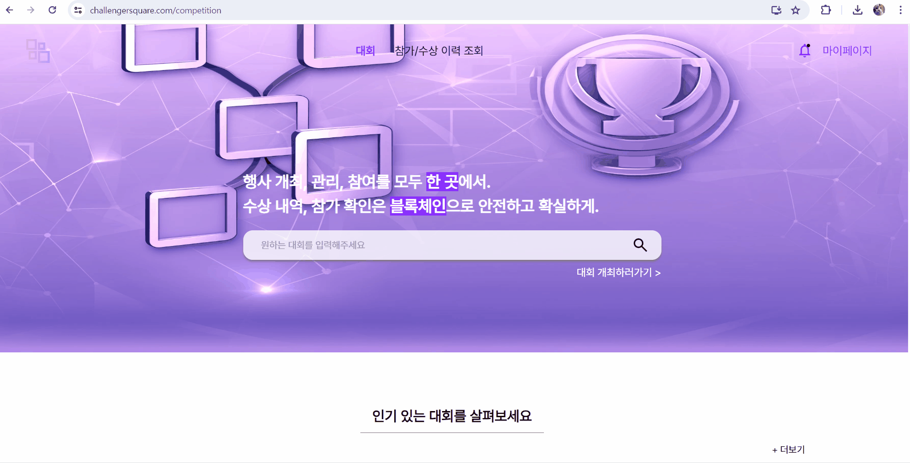

대회 신청

대회 신청 취소
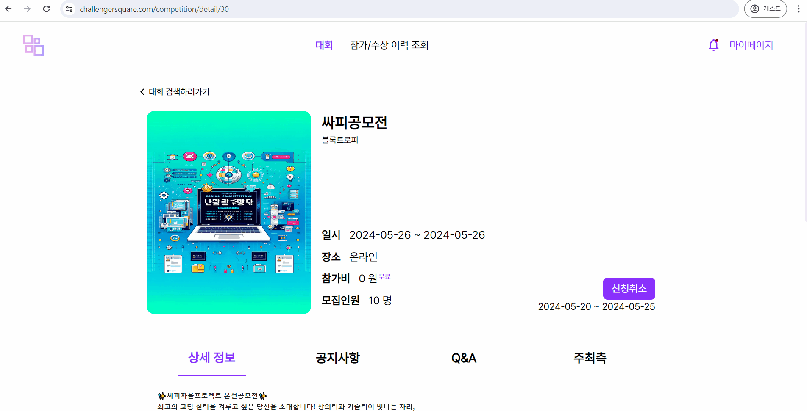
대회 취소

대회 관리
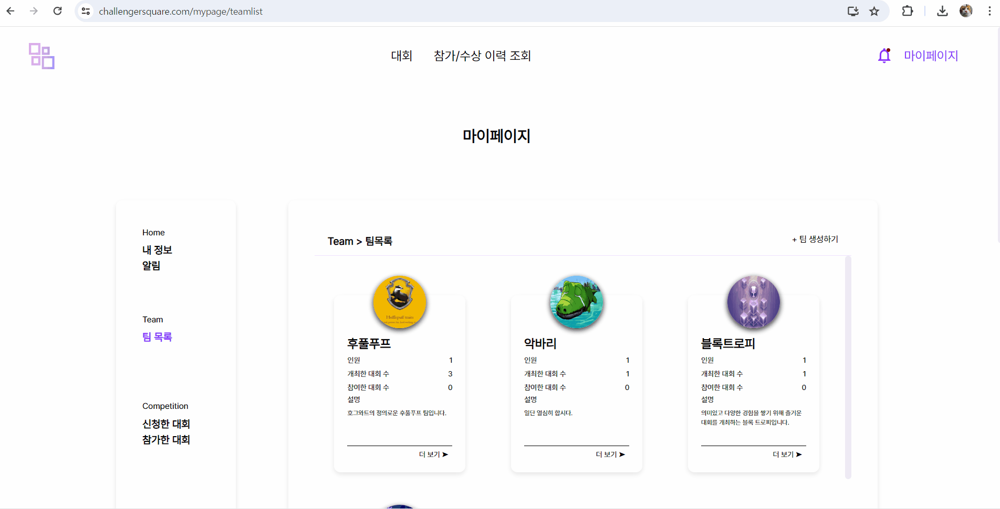

### 대회 공지사항
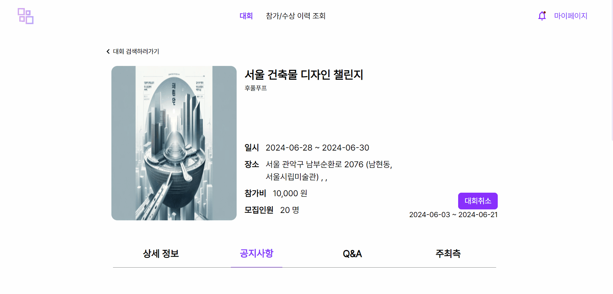

### 대회 QnA
질문 등록
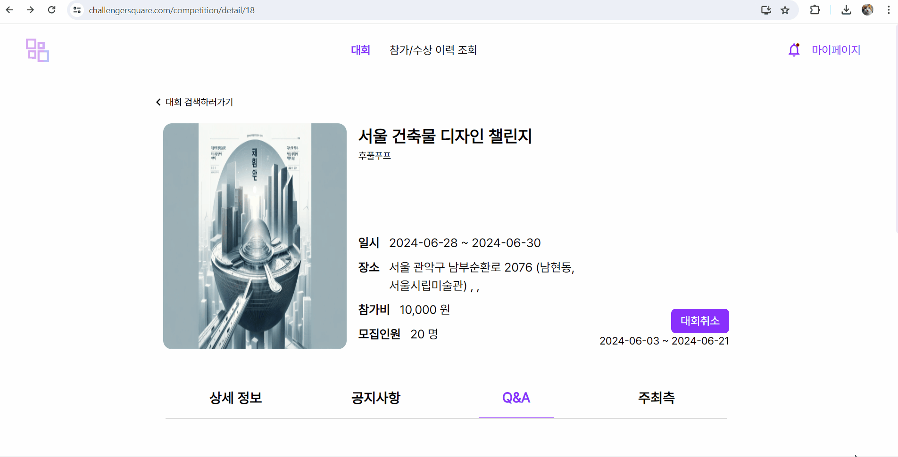
질문에 답변 등록
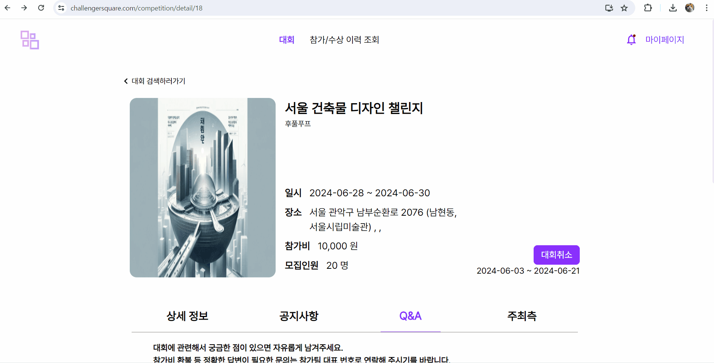

### 블록체인 대시보드
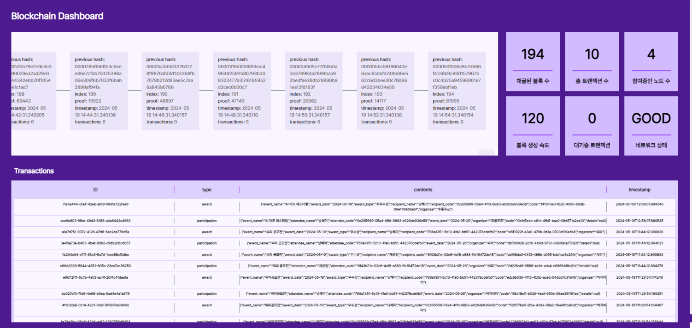

 

## **🔍 서비스 의의**
- 비용 절감 
    - 가장 대중적인 블록체인 네트워크인 이더리움의 경우, 간단한 이더리움 송금 한 번에 약 0.26달러가 소모되며,  
    새로운 계약(정보 저장 규칙 등) 
한 번 배포에 1.35달러의 비용이 들어감

- 맞춤형 설계
    - 프로젝트에 알맞은 기능만 제작함으로써 자원을 절약하면서 최적의 기능을 구현할 수 있음.  
    본 네트워크는 정보저장만을 목적으로 하기에 암호화폐 기능을 구현하지 않음.

- 혁신과 실험
    - 새로운 합의 알고리즘, 데이터 구조, 스마트 계약 기능 등을 실험하고 도입해 보는데 의의가 있음.